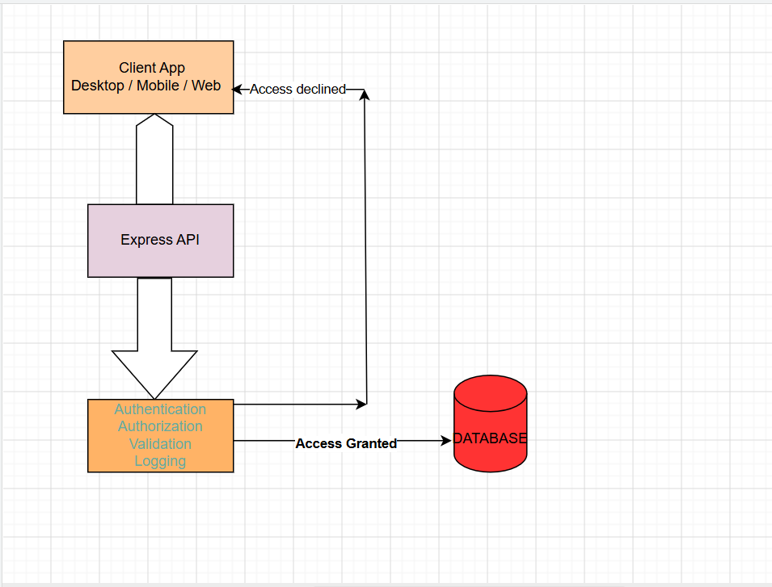

# E-Commerce API

A RESTful E-Commerce API built with Node.js, Express, and MongoDB. The API provides secure product and user management through authentication, authorization, search, filtering, and pagination features.

---

## Overview

This API serves as the backend for an e-commerce platform, allowing applications to manage products and users securely. It provides endpoints for authentication, product management, inventory tracking, and role-based access control.

### Product Attributes

Each product contains the following fields:

* **Name** – Product name
* **Price** – Product price
* **Description** – Detailed product information
* **Category** – Product category
* **InStock** – Product availability status

---

# Problem Statement

Managing products and users manually can be inefficient, insecure, and difficult to scale. This API addresses these challenges by providing:

* Centralized product management
* User authentication and authorization
* Inventory tracking
* Data validation
* Product search and filtering
* Pagination support
* Secure access control
* Scalability for future integrations

---

# Key Features

## Product Management

* Create products
* Retrieve products
* Update products
* Delete products
* Search products
* Filter products
* Pagination support

## User Management

* User registration
* User login
* Update user profile
* Delete user account

## Authentication & Authorization

* JWT Authentication
* Protected Routes
* Role-Based Access Control (RBAC)

### Access Control

| Role  | Permissions                     |
| ----- | ------------------------------- |
| User  | View products                   |
| Admin | Create, Update, Delete products |
| Admin | Manage users                    |

---

# Technology Stack

## Backend

* Node.js
* Express.js

## Database

* MongoDB Atlas

## Security

* JSON Web Tokens (JWT)
* bcrypt

## Validation

* Joi

## Configuration

* dotenv

## File Upload

* multer

---

# Features Implemented

* Authentication
* Authorization
* Error Handling
* Middleware
* CORS
* Joi Validation
* Logging
* Product Search
* Filtering
* Pagination
* Password Hashing (bcrypt)
* JWT Token Generation
* Refresh Tokens
* File Uploads (multer)

---

# Future Enhancements

The following technologies and features are planned for future implementation:

* Email Service (Nodemailer)
* Logging (Pino / File System)
* External API Integration (Axios / Fetch)
* Frontend Integration (React Native)
* Redis Caching
* WebSockets (Socket.io)
* Automated Testing (Jest)
* Sequelize ORM
* MySQL Database Support

---

# Project Methodology

## User Model

```javascript
{
  name: String,
  email: String,
  password: String
}
```

## Product Model

```javascript
{
  userId: ObjectId,
  name: String,
  price: Number,
  description: String,
  category: String,
  inStock: Boolean,
  createdAt: Date
}
```

### User Controllers

* registerUser()
* loginUser()
* updateUser()
* deleteUser()

### Product Controllers

* createProduct()
* getProducts()
* updateProduct()
* deleteProduct()

---

# API Endpoints

## Authentication

### Register User

```http
POST /api/auth/sign-up
```

### Login User

```http
POST /api/auth/login
```

---

## Users

### Search Users

```http
GET /api/user/search
```

### Get User By ID

```http
GET /api/user/:id
```

### Update User

```http
PATCH /api/user/:id
```

### Delete User

```http
DELETE /api/user/:id
```

---

## Products

### Create Product

```http
POST /api/products
```

### Get All Products

```http
GET /api/products
```

### Update Product

```http
PUT /api/products/:id
```

### Delete Product

```http
DELETE /api/products/:id
```

---


# Installation

## Clone Repository

```bash
git clone <repository-url>
cd ecommerce-api
```

## Install Dependencies

```bash
npm install
```

## Start Development Server

```bash
npm run dev
```

## Start Production Server

```bash
npm start
```

---

# Architecture Diagram

```text
docs/
└── architecture-diagram.png
```

```markdown

```

---

# Expected Outcome

The E-Commerce API provides a secure, scalable, and maintainable platform for managing products and users. Through authentication, authorization, validation, search, filtering, and pagination, the system ensures a reliable and efficient user experience.

---


# Authors

Developed by **
Agu Michael
Japheth
Promise
Azeem
Humble**


<!-- # E-COMMERCE API
An E-commerce API (Application Programming Interface) is a set of rules and protocols that enables different software applications to communicate and exchange data within an e-commerce ecosystem. It acts as the bridge between the client-side application (web or mobile) and the database, allowing secure and efficient management of product information.

In this project, we are building an E-commerce API that manages products with the following attributes:

Name – The product name.
Price – The cost of the product.
Description – Detailed information about the product.
Category – The classification of the product.
InStock – Indicates product availability.

Additionally, the system includes user authentication and authorization, ensuring that only authorized users can access or modify specific resources.

## Problems the API Seeks to Solve
1. Product Information Management

Managing product information manually can be inefficient and error-prone. The API provides a centralized platform for creating, retrieving, updating, and deleting product data.

2. Data Validation and Integrity

Invalid product details such as missing names, negative prices, or incorrect categories can affect business operations. The API validates incoming data to ensure accuracy and consistency.

3. Inventory Management

Customers should not be able to purchase products that are unavailable. The API tracks stock availability through the InStock field, helping businesses manage inventory effectively.

4. Secure Access to Resources

One of the major challenges in e-commerce systems is preventing unauthorized access to sensitive operations. Without proper security measures, anyone could create, modify, or delete products.

## To solve this problem, the API implements:

Authentication using JSON Web Tokens (JWT).
Protected Routes that require a valid token before access is granted.
Authorization to restrict certain operations to administrators only.

For example:

Regular users can view products.
Administrators can create, update, and delete products.
User-management endpoints are accessible only to administrators.

This ensures that sensitive business operations are protected from unauthorized users.

5. User Management and Role Control

The system supports different user roles, such as User and Admin. This helps enforce access control policies and ensures that users can only perform actions permitted by their role.

6. Efficient Product Search and Retrieval

As the number of products grows, finding specific products becomes more difficult. The API provides search, filtering, and pagination capabilities to improve performance and user experience.

7. Scalability and Integration

Modern e-commerce systems often need to integrate with mobile applications, payment systems, analytics tools, and third-party services. The API provides a scalable architecture that supports future growth and integrations.

## Expected Outcome
The final E-commerce API will provide a secure, scalable, and efficient platform for managing products and users. Through authentication, protected routes, and role-based access control, the system ensures that sensitive operations are restricted to authorized users while maintaining data integrity, inventory accuracy, and a seamless user experience.

## Methodology
- Create two models which includes; Users(name, email, password) and Products(userId, Price, Descritpion, Category, inStock, timeStamp)
- Write a logic controllers for Users and Product which will include(registerUser, loginUser, Update and deleteUser), and Products(postProduct, getProduct, patchProduct and deleteProduct)
- Note a user access right to get listed products and make purchases while an Admin access right to postProduct, deleteProduct and updateProduct.

## Technology
- Runtime: Node.js + Express
- Database: MongoDB Atlas
- Config: Dotenv

## ARCHITECTURAL DIAGRAM


## Features Implemented
- Error handling
- Middleware
- CORS
- Validator - joi
- Logs
- Filtering
- Pagination
- Product Search
- Backend - Express, Nodejs
- bcrypt: for password hashing
- JWT: Token generation. Refresh Tokens
- multer: for document upload

## Requirements to be included

- Email service: nodemailer
- Logging: FS or Pino 
- External API: axios or fetch
- Frontend and Backend Connection: react-native
-  Caching: redis
- Websockets: socket.io node http
- Testing: jest
- Database - sequelize and mysql2

## ENDPOINTS COLLECTION
http://localhost:2026/api/auth/sign-up METHOD: POST
http://localhost:2026/api/auth/login METHOD: POST
http://localhost:2026/api/user/search METHOD: GET
http://localhost:2026/api/user/:id  METHOD: GET
http://localhost:2026/api/user/:id METHOD: PATCH
http://localhost:2026/api/user/:id METHOD: DELETE
http://localhost:2026/api/products METHOD: POST
http://localhost:2026/api/products METHOD: GET
http://localhost:2026/api/products/:id METHOD: PUT
http://localhost:2026/api/products/:id METHOD: DELETE -->